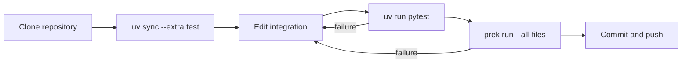
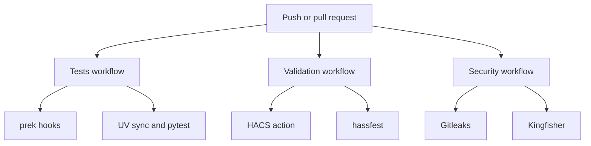
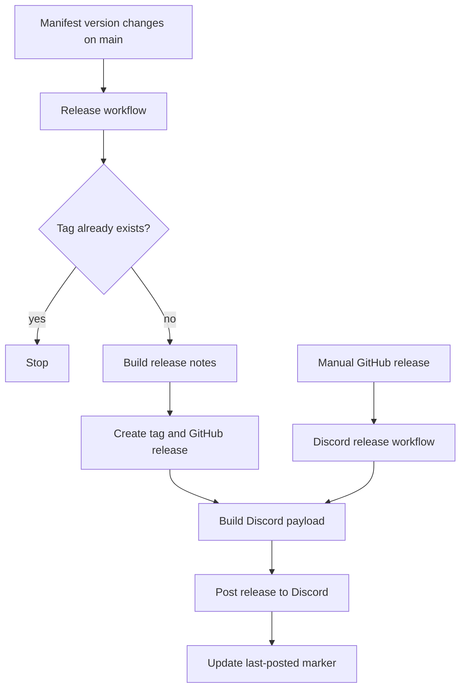

# Development and release workflow

This document explains how local checks, GitHub Actions, HACS validation, and releases fit together. It is intended for PowerSync maintainers and contributors.

## Local development

UV owns the Python environment and lock file. The `test` extra contains the dependencies needed by the standalone test suite. Home Assistant remains in the development dependency group because Home Assistant installs the integration's runtime requirements from `manifest.json`.

```bash
uv sync --extra test
for test_file in tests/test_*.py; do uv run pytest "$test_file" -q; done
uvx prek run --all-files
```



## Pull requests and pushes

GitHub runs independent jobs so a failure identifies the affected part of the repository. Tests and prek check the Python project. HACS and hassfest check the custom integration package. Gitleaks and Kingfisher scan committed content for secrets.



The validation workflow also runs every day. This catches changes in HACS and hassfest even when the repository has not changed.

## Release path

PowerSync releases remain driven by the version in `custom_components/power_sync/manifest.json`. A version change on `main` creates the tag and GitHub release. The release job posts to Discord directly because GitHub does not start a second workflow when a release is created with `GITHUB_TOKEN`. Manually published releases use the separate Discord workflow.



`RELEASE_NOTES.md` must start with the manifest version marker expected by the release workflow when it contains hand-written notes. If the file is empty, the workflow builds notes from commits.

## Configuration ownership

| File | Purpose |
| --- | --- |
| `pyproject.toml` | Python version, dependency groups, pytest, and Ruff settings |
| `uv.lock` | Reproducible dependency resolution |
| `.pre-commit-config.yaml` | Hooks executed by prek locally and in CI |
| `.github/workflows/tests.yml` | Lint and test jobs |
| `.github/workflows/validate.yml` | HACS and hassfest validation |
| `.github/workflows/security.yml` | Secret scanning |
| `.github/workflows/release.yml` | Version-driven release and automated Discord notification |
| `.github/workflows/discord-release.yml` | Discord notification for manually published releases |
